# 1.Gravity-Roller-Conveyor

## Assembly

## Parts 

### 1. Structure Frame

### 2. Adjusting pad

### 3. Mounting bracket

### 4. Height adjusting attachment

### 5. Roller

#  2.Universal Joint
## Assembly

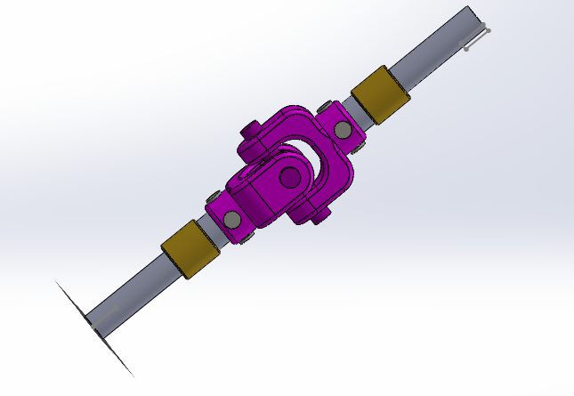

## Parts 

### 1.Yoke 

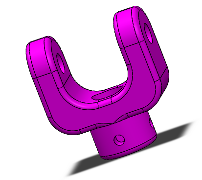

### 2.Block

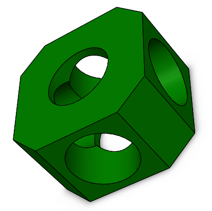

### 3. Pin

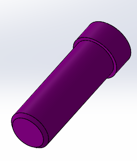

### 4.Snap Ring 

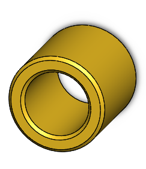

### 5.Assembly Tool

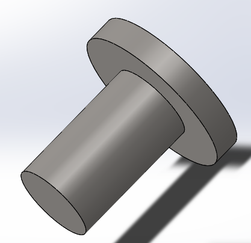

### 6.Main Shaft

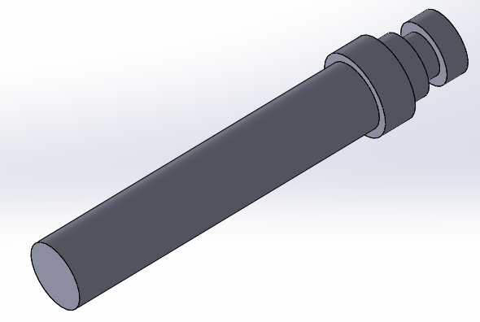

# 3.Bench Vice

## Assembly

## Parts 

### 1. Base

### 2.Jaw

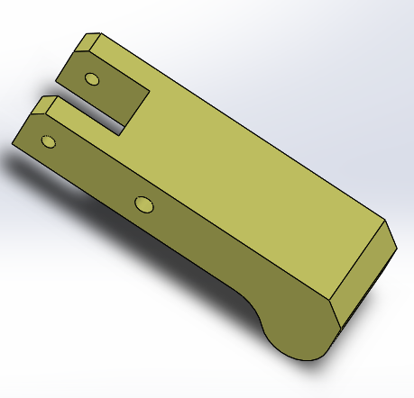

### 3. Jaw Holder

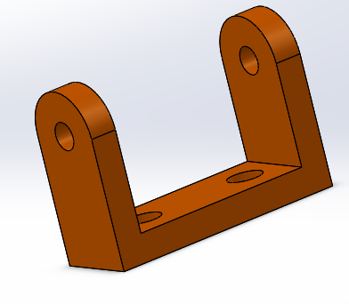

### 4.Roller

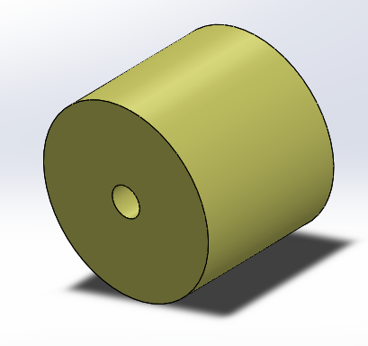

### 5. MOving Block

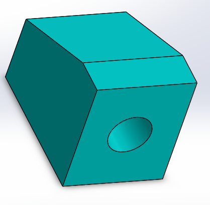

### 6. Handle rod

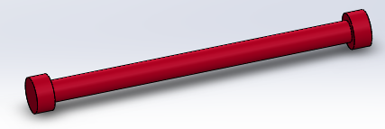

### 7. Adjusting Screw

